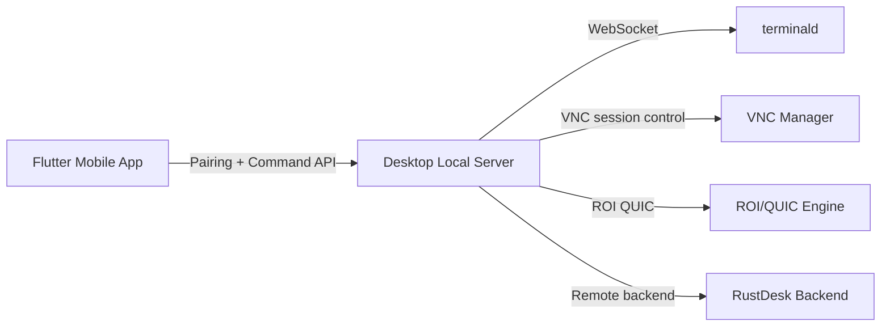

# Vibe Inspect

[](https://github.com/connecteverone/vibe-inspect/actions/workflows/terminal-cross-os.yml)

**Vibe Inspect** is a mobile-first remote operations workspace for developer machines and lab hosts.

It combines:
- a **Flutter mobile client** (`mobile/`) for pairing, terminal workflows, and remote control UI
- a **Rust desktop agent** (`desktop/`) for command routing, terminal service proxying, VNC/ROI, and RustDesk integration

## Why This Project

| Core Advantage | What it means in practice |
| --- | --- |
| Mobile-first operations | Troubleshoot and operate desktop environments directly from phone/tablet workflows. |
| One agent, multiple channels | Terminal, VNC/ROI, and RustDesk-backed remote paths share one pairing/auth model. |
| QUIC-ready remote stack | Experimental low-latency transport paths are built in for remote display workflows. |
| Practical observability | Built-in scripts/docs for guardrails, transport checks, and terminal reliability validation. |
| Open-source safe baseline | Secret scanning and token hygiene are first-class requirements for this repository. |

## What You Can Do

- Pair mobile and desktop agent through QR + token flow.
- Run terminal sessions remotely (including `terminald`/`vibe-ctl` workflows).
- Start remote display sessions through VNC/ROI or RustDesk-backed paths.
- Validate networking/performance behavior with local scripts and protocol docs.

## Architecture At A Glance



## Repository Structure

```text
vibe-inspect/
├─ mobile/                 # Flutter app (pairing, terminal, VNC/remote UI)
├─ desktop/                # Rust desktop agent + terminald/vibe-ctl binaries
├─ scripts/                # verification, benchmark, and security scripts
├─ docs/                   # architecture, specs, runbooks, and plans
├─ third_party/rustdesk/   # upstream submodule dependency
└─ SECURITY.md             # disclosure + secret handling policy
```

Detailed developer map: [`docs/developer_guide.md`](docs/developer_guide.md)

## Quick Start

### 1. Clone and initialize submodules

```bash
git clone https://github.com/connecteverone/vibe-inspect.git
cd vibe-inspect
git submodule update --init --recursive
```

### 2. Prepare mobile workspace

```bash
cd mobile
flutter pub get
```

### 3. Run required checks

```bash
cd mobile && flutter test
cd mobile && flutter analyze
./scripts/flutter_test.sh
./scripts/flutter_analyze.sh
```

### 4. Optional browser smoke check

```bash
cd mobile && flutter build web
cd mobile/build/web && python3 -m http.server 8030 --bind 127.0.0.1
```

## Desktop Quickstart (Headless)

For local API/transport testing without Tauri UI:

```bash
cd desktop
cargo run --bin vnc_headless -- --port 58888 --quic-port 58889
```

Then in another shell:

```bash
export AGENT_URL="http://127.0.0.1:58888"
export AUTH_TOKEN="<AUTH_TOKEN_FROM_VNC_HEADLESS_OUTPUT>"
curl -sS "$AGENT_URL/health"
```

Terminal daemon tools:

```bash
cd desktop
cargo run --bin terminald
cargo run --bin vibe-ctl -- ls
```

## Usage Examples (Safe Placeholders)

Never paste real production credentials into examples. Use placeholders only.

```bash
export AGENT_URL="http://127.0.0.1:58888"
export AUTH_TOKEN="<AUTH_TOKEN>"
```

Health check:

```bash
curl -sS "$AGENT_URL/health"
```

Command API ping:

```bash
curl -sS "$AGENT_URL/command" \
  -H "Content-Type: application/json" \
  -H "x-agent-token: $AUTH_TOKEN" \
  -H "x-client-id: demo-mobile" \
  -H "x-client-name: demo-device" \
  -d '{
    "request_id": "req-ping-1",
    "command": "ping"
  }'
```

List terminal sessions via command envelope:

```bash
curl -sS "$AGENT_URL/command" \
  -H "Content-Type: application/json" \
  -H "x-agent-token: $AUTH_TOKEN" \
  -d '{
    "request_id": "req-term-list-1",
    "command": "terminal",
    "payload": { "action": "list" }
  }'
```

Create one-time WebSocket ticket:

```bash
curl -sS "$AGENT_URL/command" \
  -H "Content-Type: application/json" \
  -H "x-agent-token: $AUTH_TOKEN" \
  -d '{
    "request_id": "req-ws-ticket-1",
    "command": "ws_ticket",
    "payload": {
      "scope": "terminal_ws",
      "session_id": "<TERMINAL_SESSION_ID>"
    }
  }'
```

`vibe-ctl` quick sample:

```bash
cd desktop
cargo run --bin vibe-ctl -- defaults
cargo run --bin vibe-ctl -- ls
```

## Verification And Guardrails

- Flutter checks:
  - `cd mobile && flutter test`
  - `cd mobile && flutter analyze`
  - `./scripts/flutter_test.sh`
  - `./scripts/flutter_analyze.sh`
- Secret checks:
  - `./scripts/security_scan.sh`
- Terminal reliability checks:
  - `./scripts/terminald_service_health_check.sh`
  - `./scripts/terminal_failure_budget_check.sh`

## Security

This repo is designed for open-source publication:
- Never commit API keys, private keys, passwords, or production tokens.
- Keep real credentials in local environment variables or a secret manager.
- Use sanitized placeholders such as `<AUTH_TOKEN>` in docs and examples.

Policy details: [`SECURITY.md`](SECURITY.md)

## iOS FFI Symbol Retention Guardrail

RustDesk iOS bridge uses `DynamicLibrary.process().lookup(...)`, so release dead-strip can remove required C ABI symbols.

Before shipping iOS release builds:

```bash
cd mobile && flutter build ios --release --no-codesign
cd mobile && nm -gU build/ios/iphoneos/Runner.app/Runner | rg "rustdesk_main_init|rustdesk_set_direct_only|rustdesk_session_add"
```

Reference: `docs/remote_rustdesk_integration.md` section `iOS FFI symbol retention guardrail`.

## Documentation Map

Start here:
- [`docs/README.md`](docs/README.md)
- [`docs/developer_guide.md`](docs/developer_guide.md)
- [`desktop/README.md`](desktop/README.md)

Architecture and integration:
- [`docs/remote_arch_v2.md`](docs/remote_arch_v2.md)
- [`docs/remote_rustdesk_integration.md`](docs/remote_rustdesk_integration.md)
- [`docs/agent-connection-v1.1-spec.md`](docs/agent-connection-v1.1-spec.md)

Operations and validation:
- [`docs/terminald_service_management.md`](docs/terminald_service_management.md)
- [`docs/terminal_compatibility_matrix.md`](docs/terminal_compatibility_matrix.md)
- [`docs/vnc_sop.md`](docs/vnc_sop.md)

Contributing:
- [`CONTRIBUTING.md`](CONTRIBUTING.md)
